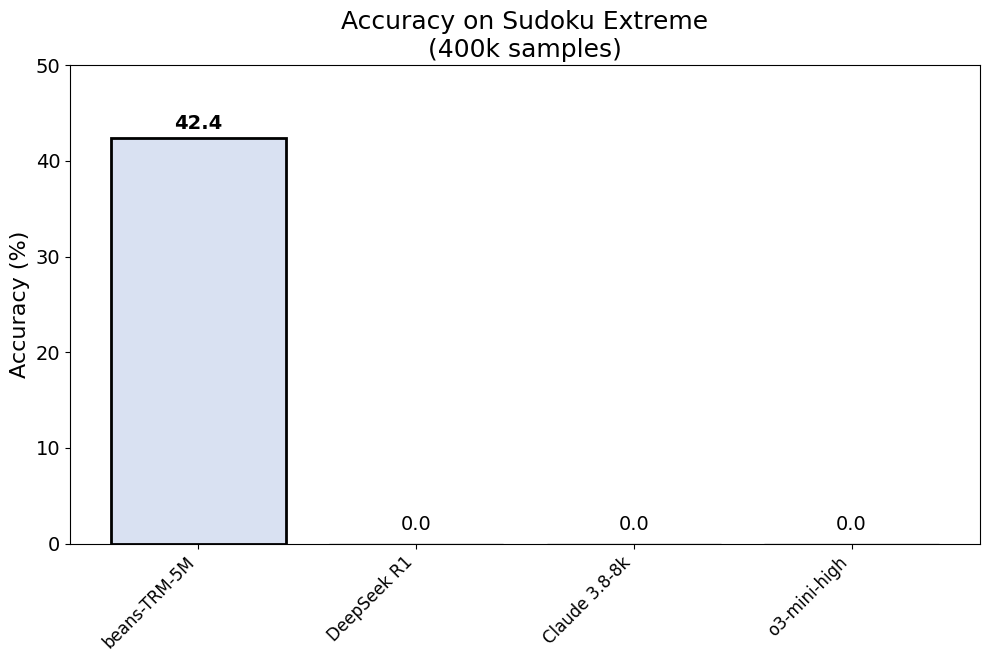

# Tiny Recursive Model (5M Parameters)

architecture reference - Less is More: Recursive Reasoning with Tiny Networks (https://arxiv.org/pdf/2510.04871)

<br/>

## Project Structure

- `configs/`: yaml configuration files for training.
- `dataset/`: scripts for building and loading the Sudoku dataset.
- `models/`: core model implementation, including layers, embeddings, and the main recursive reasoning architecture.
- `utils/`: helper functions.
- `pretrain.py`: main file

<br/>

## Training Notes 

The 5M parameter TRM was trained on a single NVIDIA P100 GPU with 16GB of VRAM. The training ran successfully for 888 steps, after which the process crashed due to a CUDA Out of Memory (OOM) error. I am currently investigating the root cause.

I suspect recursive carry state is the primary suspect. Even though we explicitly move it to the CPU after each step, a reference to the GPU tensor might still be stored in the computation graph or elsewhere, ig. 

<br/>

## Usage 

### build dataset 

```bash
python -m dataset.build_sudoku_dataset \
  --output-dir data/sudoku-extreme-1k-aug-1000 \
  --subsample-size 1000 \
  --num-aug 1000
```

### then run the train file 

```bash
python pretrain.py
```
<br/>

## Accuracy Log 



